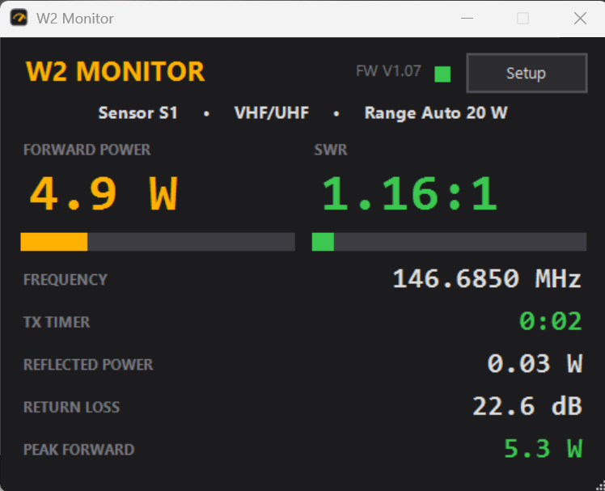
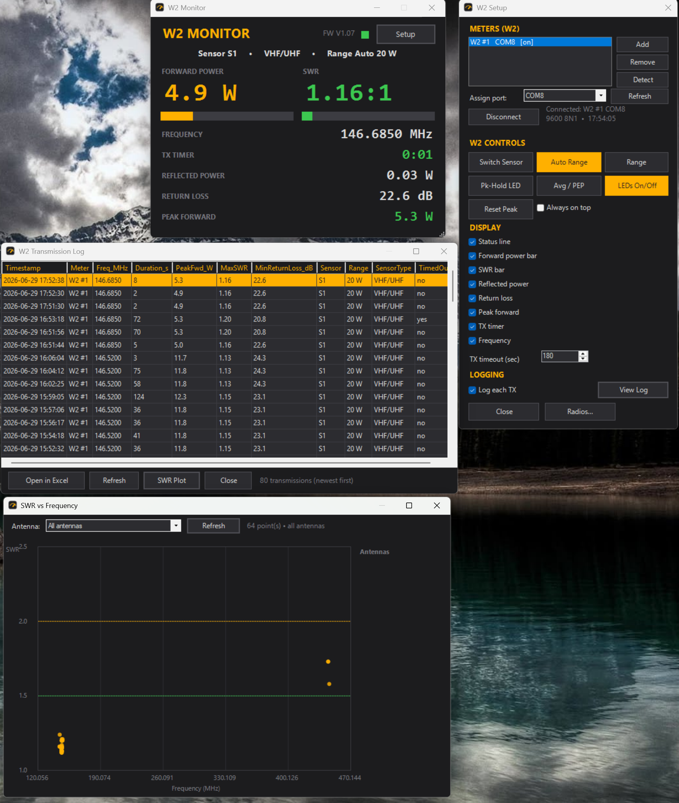

# W2 Monitor

A modern, dark‑themed Windows desktop monitor for **Elecraft W2** RF power / SWR
meters — with live frequency from your radio, a transmit‑timeout timer, per‑over
logging, and an SWR‑vs‑frequency plot.

W2 Monitor talks directly to one or more W2 meters over serial and gives you a
clean, resizable readout that replaces the legacy W2 Utility. Each meter — and each
bound radio — runs on its own background thread, so the display stays glassy‑smooth
no matter what else is going on. Built for the VHF/UHF‑and‑up world where the W2 lives.

> **Beta (v0.9.0):** in active on‑air use, but not yet broadly field‑tested.
> Bug reports and suggestions are very welcome — open an [issue](https://github.com/gsa700/w2-monitor/issues).

## Features

- **Live readout** — forward power, SWR, reflected power, return loss, and peak‑hold,
  with bar graphs and SWR color coding (green / amber / red).
- **Multiple W2 meters** at once — each on its own background runspace; the display
  auto‑focuses whichever sampler is transmitting. A **Detect** button finds connected meters.
- **Live frequency** per sampler from your radio, via three drivers:
  - Kenwood **TM‑D710 / TM‑V71A**
  - Kenwood **TS‑2000 / Elecraft / SmartSDR** CAT
  - **Hamlib `rigctld`** (network) — share one rig across apps, or monitor remotely.
- **TX timeout timer** with a configurable TOT: turns **solid yellow 30 s before**
  timeout and **red‑flashing at/after** timeout while it keeps counting — and it's
  **silent**, so nothing goes out over the air.
- **Per‑transmission logging** to CSV (time, meter, frequency, duration, peak forward,
  max SWR, min return loss, sensor, range, type, timed‑out), with an in‑app log
  reader and one‑click **Open in Excel**.
- **SWR‑vs‑frequency plot** built from your logged overs — see how each antenna
  behaves across the band, colored and filtered per antenna.
- **Resizable, scaling UI** with toggleable rows; window positions, size, ports, and
  every preference **persist between sessions**.

## Screenshots

Main readout, Setup, the transmission log, and the SWR‑vs‑frequency plot:

## Requirements

- **Windows 10 / 11** (.NET Framework — already built in; nothing to install)
- An **Elecraft W2** with its serial or USB interface (KXSER / KXUSB) on a COM port
- *(optional)* a **CAT radio** for live frequency
- *(optional)* **[Hamlib](https://hamlib.github.io/)** if you want the shared/network `rigctld` driver

## Install

1. Download the latest **[release](https://github.com/gsa700/w2-monitor/releases/latest)**
   (the “Source code (zip)” is a clean, ready‑to‑run package).
2. **Right‑click the zip → Properties → Unblock**, then extract it anywhere.
3. Run **`Launch W2 Monitor.vbs`**. (Double‑run **`Create Desktop Shortcut.vbs`** once
   to drop a desktop icon.)

No installer, no admin rights, nothing written to your system — the launcher just
starts the PowerShell script with the right execution policy.

## Quick start

1. Click **Setup**, assign your W2's COM port to a meter, and press **Connect**.
2. Key into a dummy load — power, SWR, and return loss update live.
3. *(optional)* **Radios…** → bind a radio to a sampler to see its frequency, logged
   with every transmission.

Full wiring, baud rates, and the Hamlib/`rigctld` walkthrough are in the
**[connection & setup guide](W2Monitor-README.md)**.

## Configuration & data

- Settings live in `W2Monitor.config.json` next to the app (auto‑created).
- Transmission logs are written to `W2_TXlog.csv` (rolling, capped at 2000 rows).
- Both are **per‑user** and excluded from the repo — your station data stays yours.

## License

Released under the **[GNU General Public License v3.0](LICENSE)**. You're free to use,
study, share, and modify it; derivative works must stay open under the same license.

## Credits

Created by **David Erickson (AB0R)** in collaboration with **Claude (Anthropic)**,
which did the heavy lifting on the code.

## Disclaimer

*Elecraft* and *Kenwood* are trademarks of their respective owners. This is an
independent project, not affiliated with or endorsed by Elecraft, Kenwood, or the
Hamlib project. The software is provided **without warranty of any kind** — you are
responsible for your station and your transmissions.

73! 📻
